---
title: Azure Functions, Queues and Table storage a.k.a Serverless architecture trough example
published: false  
description:  
tags: Azure, Functions, Serverless, net core  

---

# Azure Functions, Queues and Table storage a.k.a Serverless architecture trough example
---

_TL;DR: I wanted to buy a mouse wich was on 50% sale twice a year. I was too lazy to check when it's on sale, so I created a website that will do that for me and send me an email when there is a change on the price/availability using Azure serverless architecture and .net core framework. If you follow along, I'll teach you how to do that yourself or you can use my [website](https://product-scrape.azurewebsites.net)._

---

# Serverless buzz word
To be clear, serverless != no server, there is no such thing as web architecture where no server is involved. In my opinion serverless is a poorly chosen word for architecture that doesn't require a whole server to be dedicated to doing a job of serving a small amount of processing, retrieving or writing data. Instead, there is one `Mega-Giga-Tera` big server (usually some cloud provider such as Amazon, Azure, Google services or similar) that can be used as a place where we can deploy a very small/tiny methods (stub routines) that can deal with this tiny data processing requests.

# Idea
In this demo project, I'll try to cover a few areas of the Azure serverless architecture ecosystem and use them on a real application. My idea was to create a web page where I can create a list of products/items that are available on online shops and track their changes, and whenever there is a change on the price or availability an email with the updates will be sent to me. That way I'll save myself some time checking product prices to see when they are on sale or become available. To get details from some URL, we gonna use a [scraper](https://en.wikipedia.org/wiki/Web_scraping) to collect data from other websites. Every website/webstore has a different layout and for that, we need to configure our scraper to be able to scrape different stores.

# Azure functions
As I said earlier, I used Azure functions to establish the server-side functionality. An azure function can be triggered/called in several ways, in this demo I'll be using [Http](https://docs.microsoft.com/en-us/azure/azure-functions/functions-bindings-http-webhook-trigger?tabs=csharp), [Queue](https://docs.microsoft.com/en-us/azure/azure-functions/functions-bindings-storage-queue-trigger?tabs=csharp) and [Timer](https://docs.microsoft.com/en-us/azure/azure-functions/functions-bindings-timer?tabs=csharp) triggered functions. For more details, you can check the full documentation on this [link](https://docs.microsoft.com/en-us/azure/azure-functions/).

# Azure queues
In my example, I'll be using queues as a channel for communication between my functions. For example, when the function for detecting product change has detected some change, it sends a message to the `email-queue` and then, another function (queue triggered) for email sending is listening to that same queue, and whenever there is a new message it picks it up and sends the email accordingly. So, no direct call between the functions (methods), they communicate using the queues. That allows us to have an asynchronous workflow.  

This is the official Microsoft definition for the queues:
>_Azure Queue Storage is a service for storing large numbers of messages. You access messages from anywhere in the world via authenticated calls using HTTP or HTTPS. A queue message can be up to 64 KB in size. A queue may contain millions of messages, up to the total capacity limit of a storage account. Queues are commonly used to create a backlog of work to process asynchronously._

For more info about the queues, you can check this [link](https://docs.microsoft.com/en-us/azure/storage/queues/storage-queues-introduction).

# Azure tables
In most of the cases when you create a web application there is a need to store some data. Usually, we store it in tables or files. Depending on the nature of the application or our skills we can choose between SQL or NoSQL storage. In most of my projects, I've been using MSSQL and PostgreSQL, but in this demo, I will use Azure Table storage. 

This is Azure definition of Table storage:
>_Azure Table storage stores large amounts of structured data. The service is a NoSQL datastore which accepts authenticated calls from inside and outside the Azure cloud. Azure tables are ideal for storing structured, non-relational data._

For more details, you can check the full documentation on this [link](https://docs.microsoft.com/en-us/azure/cosmos-db/table-storage-overview).

## Accessing table data
To store or retrieve data from tables, you need to have a way to access them. In my demo application I'm be using two different approaches to access the table data:
### Direct access
You can use the Microsoft Azure Storage Libraries for .NET and have direct access to the storage tables. I used this in `IUserProfileService` for the CRUD operations. This way cheaper because you will access the data directly, bypassing azure functions.

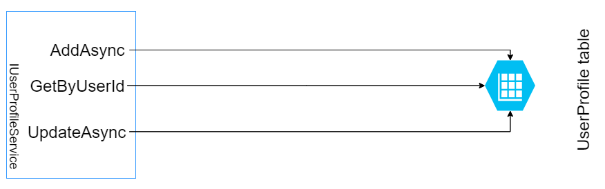
*<center>UserProfileService communication with Azure Storage</center>*

### Access using azure functions
Another way to access your data is to create an Azure Function that will do that, so instead of writing directly to the table, you will pass data to the Azure function and then the function will store the data in the table. This maybe sounds like overkill, having a 'redundant' layer (function) in the middle, because you need to maintain the function and pay for the usage of the function, but it also has its benefits. You can bind to different queues and notify them; you can easily log everything in one place and many other benefits. I use this approach in `IScrapeConfigService` implementation.

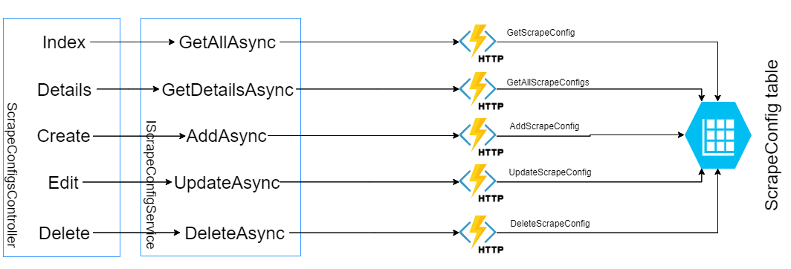
*<center>ScrapeConfigsController communication with Azure Storage</center>*

# Email sending
To send emails, I used SendGrid service integrated into Azure. It's really easy to set up an account and then using Azure Function you can easily send an email. You can bind an Azure function to `queue` and whenever you send message to that queue SendGrid will send an email. Easy Peasy.
In my demo, I've created a service that I will use to send emails whenever my app needs to send any. So, I created a Function that will accept email messages, and then it will populate all the required data if needed and send them to message queue. From that message queue, a function that is triggered on message queue will pick it and forward it to SendGrid.
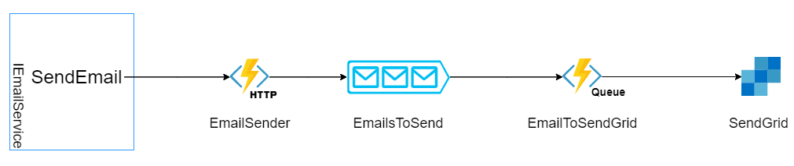
*<center>Email sending flow</center>*

# ASP.NET Identity Core
Whenever users are involved in a web application, there is always a need to be able to authenticate or authorize them. Usually, when we use .net core as a technology we tend to use Identity service. One thing that is bonded to the Identity service is that it requires MSSQL data provider, but that is now what is suitable for me in this demo since I choose to use Azure tables as storage, of course, we can make a hybrid app where identity will be stored in MSSQL and all other data in Azure tables, but I found a NuGet package that will implement all the Identity functionality but it will rely on Azure Tables, that's great. This is the package [Identityazuretable](https://dlmelendez.github.io/identityazuretable/#/) that I'll be using in this project for the identity part.
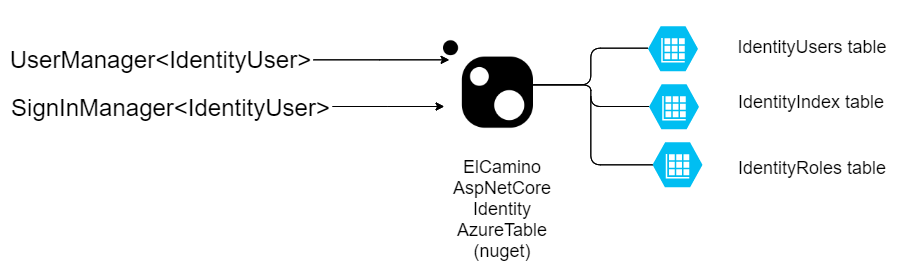
*<center>Identityazuretable architecture</center>*

# Azure resources
I've mentioned a few Azure services. To be able to reproduce this solution you will need to use several Azure resources. 
## Azure function
For the Azure functions you'll need to create a [Function App](https://portal.azure.com/#blade/HubsExtension/BrowseResource/resourceType/Microsoft.Web%2Fsites/kind/functionapp). In the process of creating the Function App, in the Hosting step you will be asked to create a Storage Account if you don't have one created previously, just type the name and the wizard will create it for you. You can see mine in the screenshots below. Once created you can check your [Storage account here](https://portal.azure.com/#blade/HubsExtension/BrowseResource/resourceType/Microsoft.Storage%2FStorageAccounts). You need this Storage Account for the Tables and Queues that we will be using in this tutorial. For the PlanType, also on the Hosting tab, I've selected Consumption(serverless) because that was the cheapest one that will serve the needs of this application. Please be aware always before creating an Azure resource to check it's pricing because it maybe will be too expensive or will not be compatible with the needs of your product/application.
 
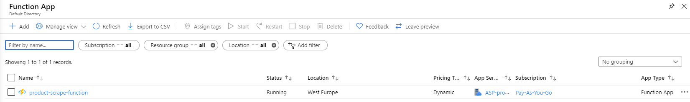  
*<center>Fuction app that I'm using in this demo</center>*
  
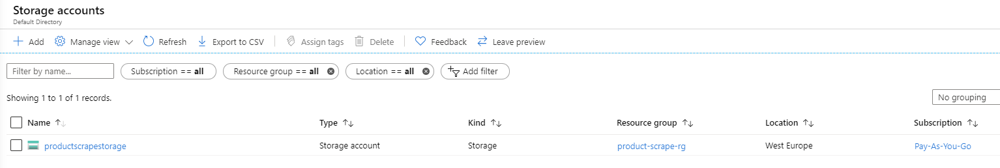
*<center>Storage account that I'm using in this demo</center>*

## Send grid
Also, I mentioned SendGrid, to be able to send emails using the Azure functions, you will need a SendGrid account, you can create one via Azure resources or create one directly on their website. Once you have created the SendGrid account, you need to obtain an ApiKey that will associate the FunctionApp with your SendGrid account (if you have any questions on this please let me know). Once you have the SendGridApiKey you will need to add to the Azure Functions Configuration settings (check the screenshots).

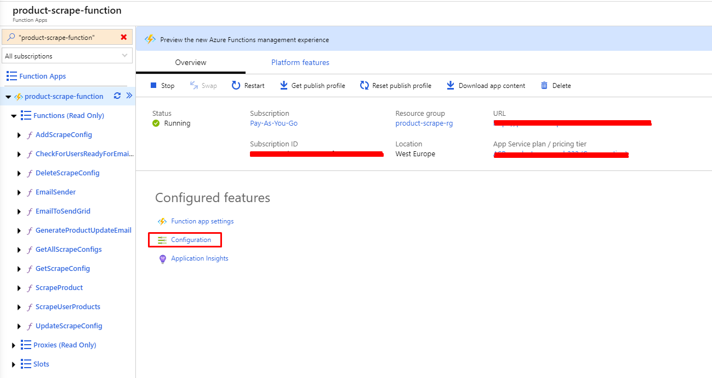    
*<center>Navigate to Azure app configuration</center>*    
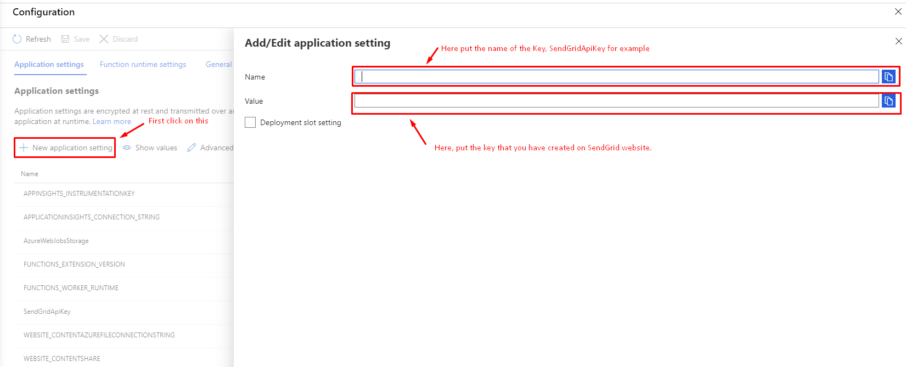
*<center>SendGrid API key configuration</center>*  

## App service
In the end, you will need an App Service or a place where you can host your website that will interact with the Azure Functions. Of course, you can host your web application anywhere and still communicate with the Azure Functions, but in this example a tired to stick with Azure services, so I've created AppService and hosted my .net core application here. Creating an App service is pretty straight forward wizard, be careful with the pricing tiers (App service plan), I've chosen the free option, but of course, there are lot more other plans that you can use to scale your application.  
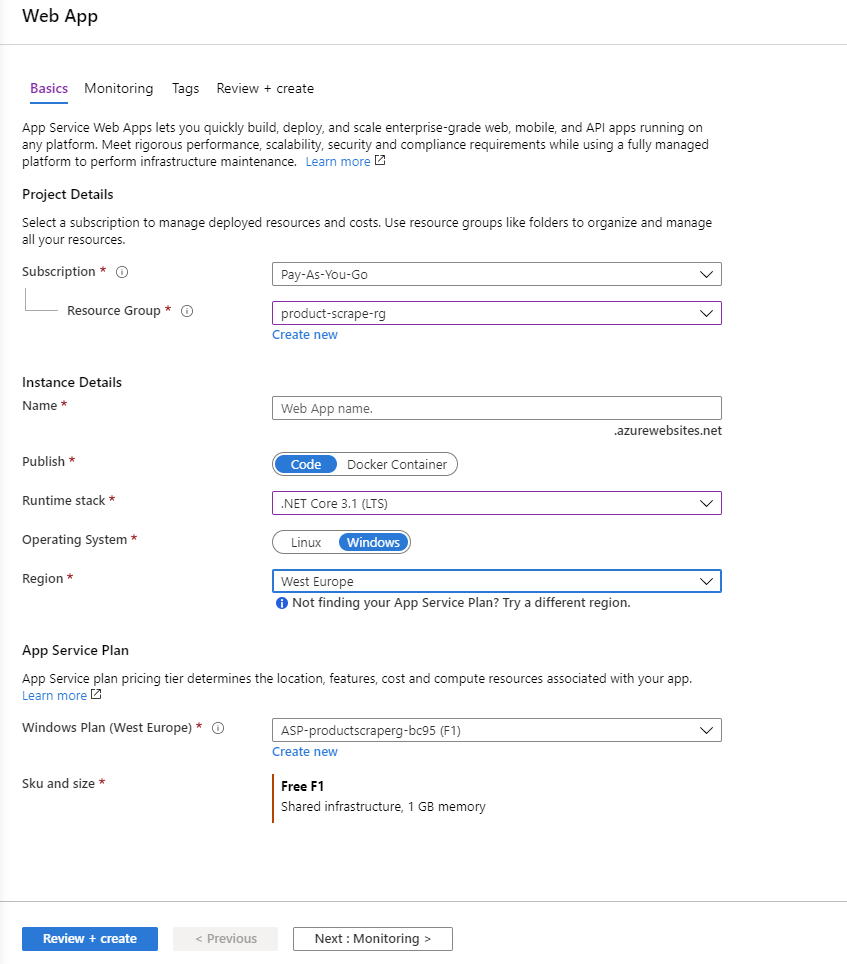  
*<center>Sample of my settings for the App service</center>*    


## Application Insights
Application Insights it's a nice way to track the health of your Function App or App Service, here you can see a lot of useful info related to the Availablity, errors, Failed Request, Server response time, Server Request and many many more things. I've created two Application Insights services, one for the Azure Function and one for the App service.  
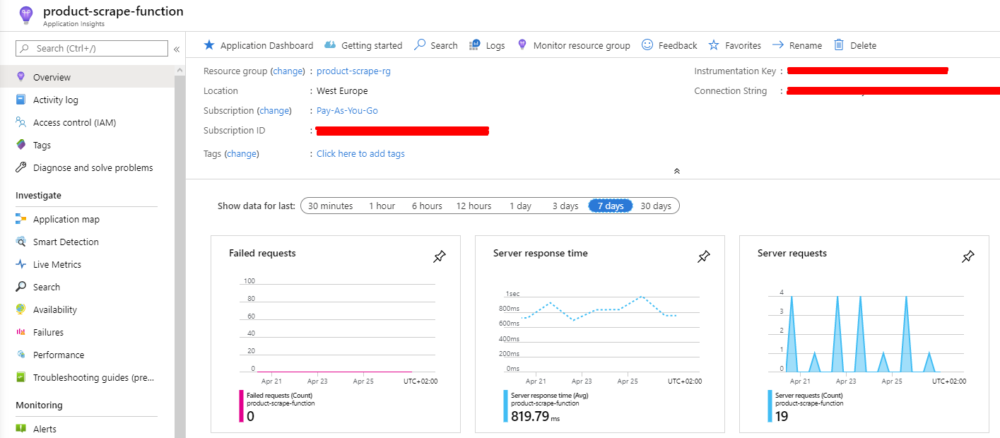  
*<center>Data that is shown in Application Insights</center>*  

## Resource group
An Azure resource group is like a namespace or folder or a group for Azure services, whenever you create a service there is a filed where you can choose on which resource group that service should belong. This is a nice thing to be able to group all your services that are related to the same project. This is extremely useful when you have several Applications ecosystems, you can easily track them and see all services that are related. For this demo, I've used the same resource group for all services, and now I can easily see all the services that I'm using for this ProductScraper project.  

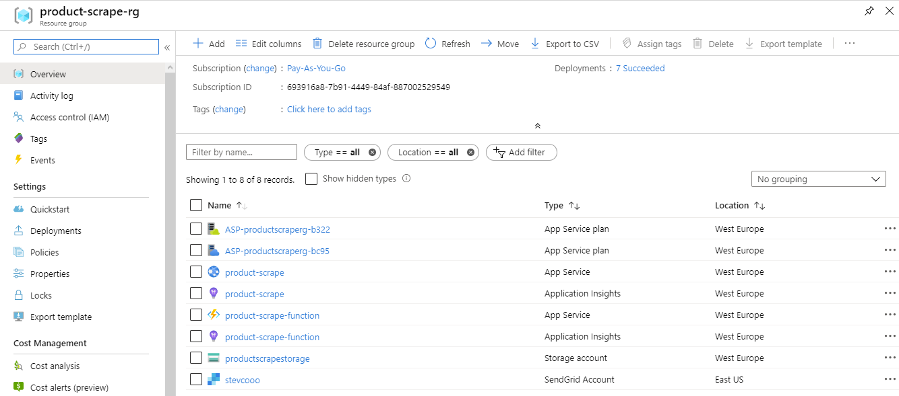
*<center>Services in the resource group that I used for this demo</center>*  


## Cost Management + Billing
The very important thing is when using online service where you have a play Pay-as-you-go, 
like in this case, to check your bill every few days to avoid big or unexpected costs. 
I've done this mistake once, I've ended up with a huge bill because I selected some pricing plan that I wasn't aware how much it will cost 
(Always check [Azure pricing](https://azure.microsoft.com/en-us/pricing/calculator/), always! ). In this [section](https://portal.azure.com/#blade/Microsoft_Azure_GTM/ModernBillingMenuBlade/Overview) you can check how much you have spent so far (if any) and witch service costs you how much.  

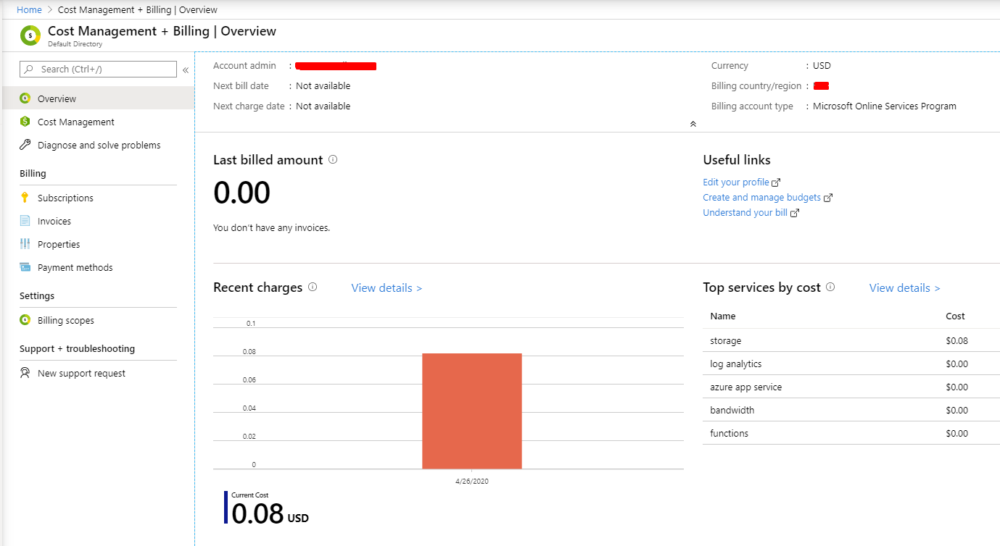
*<center>Billing sample of my demo</center>*  
  
# Product scraper solution
As I mentioned in the first sentence my idea was to build a product scraper that will collect products info and send me an email whenever there is a change in them. In the following context, I'll try to explain the most important things in the application, if something is unclear or there is no enough info provided please let me know. You can see in the repository that my solution is divided in 5 projects. I'll try to explain their purpose and the most important code in them.

## ProductScraper web
This is the web project. Here I configure the Identity settings to use `ElCamino.AspNetCore.Identity.AzureTable` NuGet package for user registration/aughentication/authorizatoin. 
You can see this configuration in [`Startup.cs`](ProductScraper/Startup.cs) file in `ConfigureServices` method.
```c#
    public void ConfigureServices(IServiceCollection services)
    {
        services.AddDefaultIdentity<IdentityUser>(options =>
        {
            options.SignIn.RequireConfirmedAccount = false;
            options.User.RequireUniqueEmail = true;
            options.Password.RequireDigit = false;
            options.Password.RequireLowercase = false;
            options.Password.RequireUppercase = false;
            options.Password.RequireNonAlphanumeric = false;
        })
        //ElCamino configuration
        .AddAzureTableStores<ApplicationDbContext>(new Func<IdentityConfiguration>(() =>
        {
            IdentityConfiguration idconfig = new IdentityConfiguration
            {
                TablePrefix = Configuration.GetSection("AzureTable:IdentityConfiguration:TablePrefix").Value,
                StorageConnectionString = Configuration.GetSection("AzureTable:StorageConnectionString").Value,
                LocationMode = Configuration.GetSection("AzureTable:IdentityConfiguration:LocationMode").Value,
                IndexTableName = TableName.IdentityIndex, // default: AspNetIndex
                RoleTableName = TableName.IdentityRoles,   // default: AspNetRoles
                UserTableName = TableName.IdentityUsers   // default: AspNetUsers
            };
            return idconfig;
        }))
        .AddDefaultTokenProviders()
        .AddDefaultUI()
        .CreateAzureTablesIfNotExists<ApplicationDbContext>(); //can remove after first run;
        
        ...
        ...
    }
```

For more detailed info how to set this configuraiton you can check on the [official project site](https://dlmelendez.github.io/identityazuretable/#/).  

  Also in [`Startup.cs`](ProductScraper/Startup.cs) file in `ConfigureServices` method there is configuration about the Azure table that I'm using. Here i add settings for each Azure table such as ConnectionString and TableName.
##### ProductInfo table config
```C#
    services.AddScoped<IAzureTableStorage<ProductInfo>>(factory =>
        {
            return new AzureTableStorage<ProductInfo>(
                new AzureTableSettings(
                    storageConnectionString: Configuration.GetSection("AzureTable:StorageConnectionString").Value,
                    tableName: TableName.ProductInfo));
        });
```
##### ScrapeConfig table config
```C#
    services.AddScoped<IAzureTableStorage<ScrapeConfig>>(factory =>
        {
            return new AzureTableStorage<ScrapeConfig>(
                new AzureTableSettings(
                    storageConnectionString: Configuration.GetSection("AzureTable:StorageConnectionString").Value,
                    tableName: TableName.ScrapeConfig));
        });
```
##### UserProfile table config
```C#
    services.AddScoped<IAzureTableStorage<UserProfile>>(factory =>
        {
            return new AzureTableStorage<UserProfile>(
                new AzureTableSettings(
                    storageConnectionString: Configuration.GetSection("AzureTable:StorageConnectionString").Value,
                    tableName: TableName.UserProfile));
        });
```

Also, in this project, in the Identity section, when new user is registed, I'm creating a record in UserPfofile table, in this table, we will keep all the aditional info related to the users.
You can see this in the [`Register.cshtml.cs`](ProductScraper/Areas/Identity/Pages/Account/Register.cshtml.cs) file in `OnPostAsync` method. Here is the code segment that is adding record to UserProfile table. You can note that Id value of IdentityUsers table record is used as Userid in UserProfile table, thats the link between this two tables.

```C#
UserProfile userProfile = new UserProfile
    {
        UserId = user.Id,
        EnableEmailNotifications = true,
        DaysBetweenEmailNotifications = 7
    };
    await _userProfileService.AddAsync(userProfile);
```
Also, there is a need some user(s) to be administrator on this aplication in order to be able to create/edit/delete `ScrapeConfigurations`, so in that manner, where in this same method when user is created i'm checking if thats the first user that creates profile, if so, then I assing Admin claim to him.
```C#
    if (await _userProfileService.GetUsersCount() == 1) 
    {
        Claim claim = new Claim(ClaimTypes.Role, ClaimValues.Admin, ClaimValueTypes.String);
        await _userManager.AddClaimAsync(user, claim);
    }
```
To be able to authorize with Claims you need to add Authorization policy in [`Startup.cs`](ProductScraper/Startup.cs) file in `ConfigureServices` method 
```C#
    services.AddAuthorization(options =>
    {
        options.AddPolicy(Policy.AdminOnly, policy => policy.RequireClaim(ClaimTypes.Role, ClaimValues.Admin));
    });
```
After you configure the policy for Admins, you can add `[Authorize(Policy = Policy.AdminOnly)]` before declaration of any controller or method in order to enforce this policy. I used this in [`ScrapeConfigsController.cs`](ProductScraper/Controllers/ScrapeConfigsController.cs).  
Or if you want to use this inside a method, you can use `User.IsInRole(ProductScraper.Common.Naming.ClaimValues.Admin)`  

Also, in this project I've created two controllers, [`ProductsController.cs`](ProductScraper/Controllers/ProductsController.cs) and [`ScrapeConfigsController.cs`](ProductScraper/Controllers/ScrapeConfigsController.cs), they using the Services created in `ProductScraper.Services` project are interacting with the data, reading and writing to Azure tables or calling Azure functions.